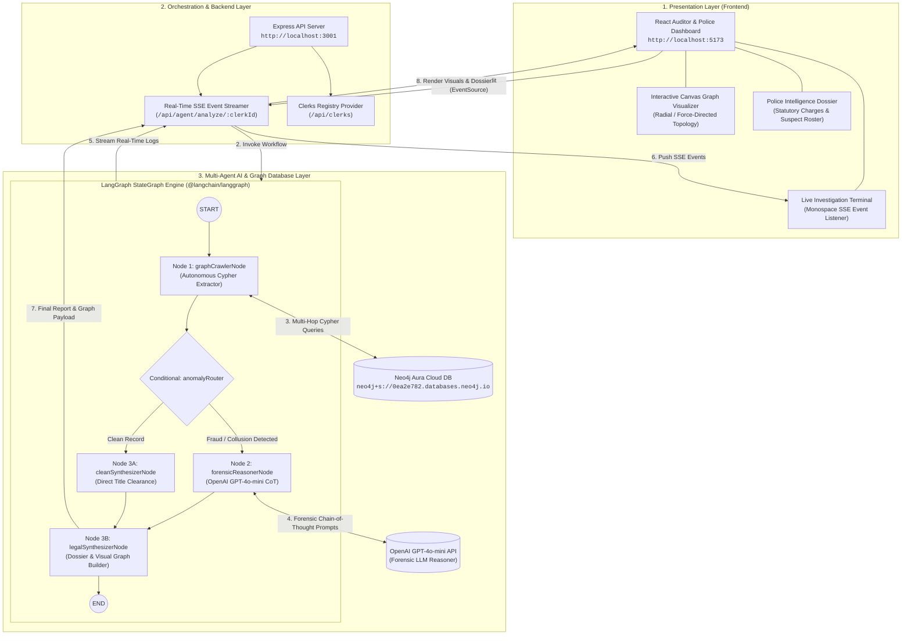
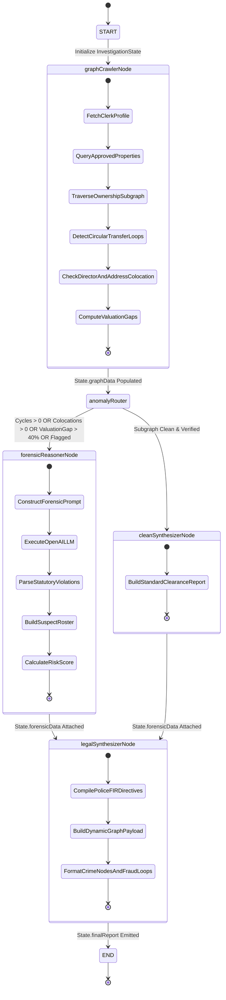
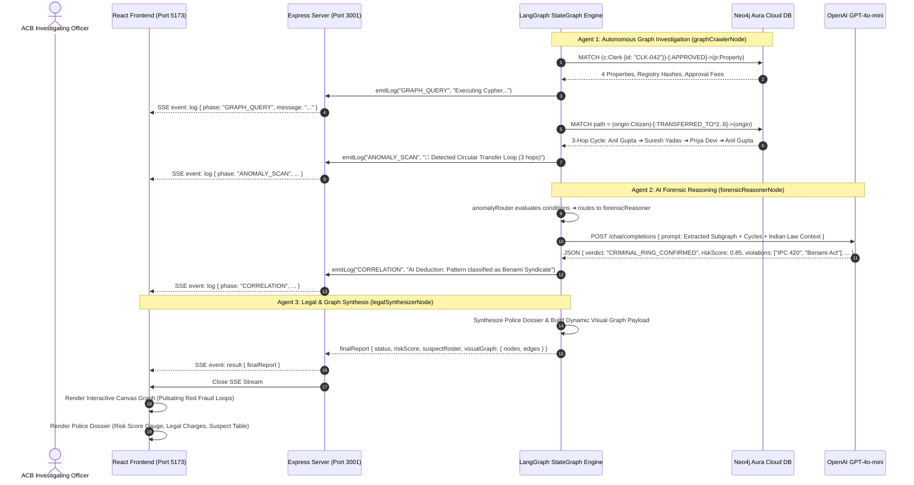

# System Architecture: BhumiRakshak (भूमि रक्षक)
### Autonomous Multi-Agent AI & Graph Intelligence Land Fraud Detection System
**Developed for Nagpur City Police & Anti-Corruption Bureau (ACB)**

---

## 1. High-Level 3-Tier System Architecture



---

## 2. LangGraph StateGraph Detailed Workflow



---

## 3. End-to-End Sequence & Data Flow

---

## 4. Neo4j Graph Database Schema Specification

### Node Labels & Properties
| Label | Key Properties | Description |
| :--- | :--- | :--- |
| `(:Clerk)` | `id`, `name`, `zone`, `department`, `serviceYears`, `status` | Sub-Registrar administrative personnel handling land title approvals. |
| `(:Property)` | `id`, `surveyNo`, `location`, `areaSqFt`, `marketValuationINR`, `circleRateINR` | Land plots and commercial real estate registered with survey numbers. |
| `(:Citizen)` | `id`, `name`, `pan`, `address`, `phone` | Individual property buyers, sellers, and beneficial owners. |
| `(:Company)` | `id`, `name`, `cin`, `registeredAddress`, `incorporationDate` | Commercial entities, builders, and shell property conduits. |

### Relationship Types
| Relationship | Connected Nodes | Properties | Indicator |
| :--- | :--- | :--- | :--- |
| `[:APPROVED]` | `(Clerk) ➔ (Property)` | `date`, `feeINR`, `registryHash` | Formal registry sanction. |
| `[:OWNS]` | `(Citizen\|Company) ➔ (Property)` | `since`, `purchasePriceINR` | Legal or beneficial ownership claim. |
| `[:TRANSFERRED_TO]` | `(Citizen\|Company) ➔ (Citizen\|Company)` | `date`, `considerationINR`, `deedNo` | Title transfer transaction. Loops denote **Benami layering**. |
| `[:DIRECTOR_OF]` | `(Citizen) ➔ (Company)` | `din`, `since` | Corporate governance & shell company linkage. |
| `[:SAME_ADDRESS_AS]` | `(Citizen\|Clerk) ➔ (Citizen\|Company)` | `flag` | Co-location indicating proxy / clerk collusion. |

---

## 5. API Contracts & Endpoints

### 1. `GET /api/clerks`
* **Purpose**: Fetches the dynamic list of administrative clerks directly from Neo4j Aura.
* **Response**:
```json
[
  {
    "id": "CLK-042",
    "name": "R. Sharma",
    "zone": "Zone 4 - Dharampeth",
    "department": "Revenue & Land Titles",
    "status": "FLAGGED",
    "properties": 4,
    "risk": "High"
  }
]
```

### 2. `GET /api/agent/analyze/:clerkId`
* **Purpose**: Initiates the LangGraph StateGraph multi-agent investigation and streams real-time logs via Server-Sent Events (SSE).
* **SSE Event Types**:
  * `event: log` $\rightarrow$ Streaming agent reasoning steps and Cypher queries:
    ```json
    { "phase": "GRAPH_QUERY", "message": "Scanning for Circular Transfer Rings...", "timestamp": "19:03:28" }
    ```
  * `event: result` $\rightarrow$ Final synthesized Police Dossier and Visual Graph payload:
    ```json
    {
      "clerkId": "CLK-042",
      "clerkName": "R. Sharma",
      "status": "CRIMINAL_RING_CONFIRMED",
      "riskScore": 0.85,
      "patternTitle": "Circular Ownership & Benami Laundering Syndicate",
      "statutoryViolations": ["IPC Section 420", "Benami Property Act 1988 (Sec 3)"],
      "suspectRoster": [{ "name": "Anil Gupta", "role": "Primary Transactor", "implication": "Circular loop orchestrator" }],
      "visualGraph": {
        "nodes": [{ "id": "CLK-042", "label": "R. Sharma", "type": "CLERK", "color": "#6c5ce7" }],
        "edges": [{ "from": "CIT-101", "to": "CIT-102", "label": "TRANSFERRED_TO", "highlight": true }]
      }
    }
    ```

---

## 6. Pitch Deck & Technical Strengths Summary

1. **Deterministic Graph Traversal + Probabilistic LLM Reasoning**:
   - Traditional AI hallucinations are eliminated because the **LangGraph StateGraph** uses deterministic Cypher queries to verify the physical multi-hop transaction chain in **Neo4j** before prompting the LLM.
2. **Real Multi-Agent Autonomy**:
   - Agent 1 crawls graph topology $\rightarrow$ Router evaluates topological complexity $\rightarrow$ Agent 2 reasons over criminal statutes $\rightarrow$ Agent 3 compiles actionable enforcement dossiers.
3. **Sub-Second Forensic Audit Velocity**:
   - Auditing a 14-year clerk history with 4-hop transaction loops takes **< 3.5 seconds**, compared to weeks of manual title searches.
4. **Law Enforcement Ready**:
   - Maps suspicious topological structures directly to Indian statutory codes (*IPC 420, IPC 120B, Benami Transactions Prohibition Act, PMLA Section 5*).
