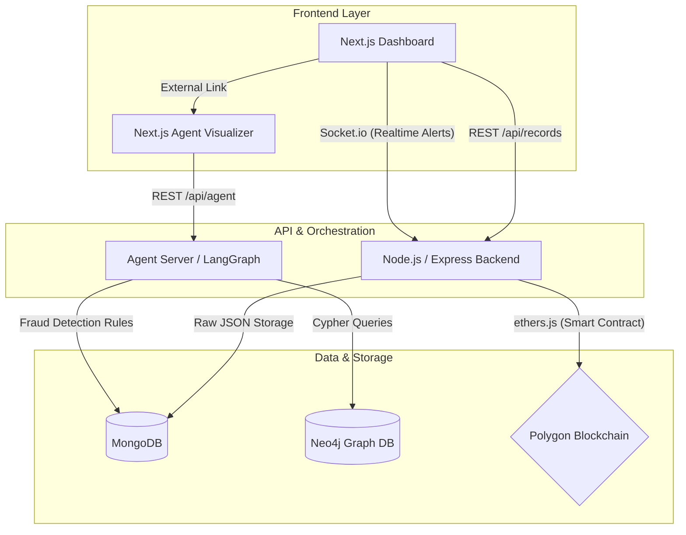

# System Architecture & Flow

This document outlines the high-level architecture and interaction flow for the **BhumiRakshak Land Fraud Detection Engine**.

## 1. High-Level Architecture Diagram
This diagram shows the relationship between the Microservices, Databases, and the Blockchain network.

## 2. Sequence Diagram: Minting & Tamper Detection
This sequence maps out exactly what happens during the hackathon demo when a property is created, maliciously hacked, and subsequently audited.

```mermaid
sequenceDiagram
    participant Clerk as NMC Clerk (UI)
    participant Backend as Node Backend
    participant Mongo as MongoDB
    participant Polygon as Polygon Amoy
    participant Auditor as Auditor (UI)
    participant Agent as LangGraph Agent

    %% Phase 1: Property Creation
    rect rgb(20, 50, 20)
    Note over Clerk, Polygon: Phase 1: Secure Property Creation
    Clerk->>Backend: POST /api/records (Property Data)
    Backend->>Backend: Generate SHA-256 Hash
    Backend->>Mongo: Save Raw JSON Data
    Backend->>Polygon: Smart Contract commitHash(propertyId, Hash)
    Polygon-->>Backend: Return Transaction Hash
    Backend-->>Auditor: Socket.io Emit "CREATE"
    Backend-->>Clerk: 201 Created (TxHash)
    end

    %% Phase 2: The Hack
    rect rgb(50, 20, 20)
    Note over Clerk, Mongo: Phase 2: The Hack (Centralized Tampering)
    Clerk->>Backend: PUT /api/hack/:id (New Fake Owner)
    Backend->>Mongo: Overwrite Owner Field in DB
    Note over Backend, Polygon: Blockchain is intentionally bypassed
    Backend-->>Auditor: Socket.io Emit "HACK"
    Backend-->>Clerk: 200 System Compromised
    end

    %% Phase 3: The Audit & AI Investigation
    rect rgb(20, 20, 50)
    Note over Auditor, Agent: Phase 3: Audit & AI Fraud Investigation
    Auditor->>Backend: GET /api/audit/:id
    Backend->>Mongo: Fetch Tampered Raw JSON
    Backend->>Backend: Generate New SHA-256 Hash
    Backend->>Polygon: GET verifyHash(:id)
    Polygon-->>Backend: Return Original Immutable Hash
    
    alt Hashes Do Not Match!
        Backend-->>Auditor: 409 TAMPERED (Alert!)
        Backend-->>Auditor: Socket.io Emit "TAMPER_ALERT"
        Auditor->>Agent: Launch AI Investigator (Neo4j)
        Agent->>Agent: Run LangGraph Fraud Stream
        Agent-->>Auditor: Stream AI Output (Colluding Clerks/Properties)
    end
    end
```

